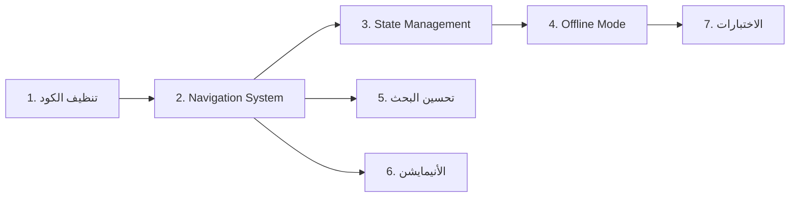

# خطة تنفيذ 7 تحسينات لتطبيق بنك دم اليمن

## ملخص عام

تنفيذ 7 تحسينات مرتبة حسب الأولوية والاعتمادية — كل مهمة سابقة تمهّد للتي بعدها.

---

## الترتيب المقترح



> [!IMPORTANT]
> **السبب:** تنظيف الكود أولاً يزيل الفوضى → Navigation يجمّع التنقل → State Management يُحسَّن على كود نظيف → Offline يعتمد على State Management → الاختبارات تُكتب على الكود النهائي.

---

## المهمة 1: تنظيف الكود المكرر ⏱️ ~2 ساعات

### المشكلة
يوجد شاشات مكررة — نسخة قديمة ونسخة محسّنة (enhanced):

| الملف القديم (يُحذف) | الملف المحسّن (يبقى) |
|---|---|
| [manage_donors_screen.dart](file:///d:/flutterprojects/yemen_blood_bank_app_V1.0.0/yemen_blood_bank_app/lib/screens/admin/manage_donors_screen.dart) (424 سطر) | [enhanced_manage_donors_screen.dart](file:///d:/flutterprojects/yemen_blood_bank_app_V1.0.0/yemen_blood_bank_app/lib/screens/admin/enhanced_manage_donors_screen.dart) (627 سطر) |
| [admin_dashboard_screen.dart](file:///d:/flutterprojects/yemen_blood_bank_app_V1.0.0/yemen_blood_bank_app/lib/screens/admin/admin_dashboard_screen.dart) | [enhanced_admin_dashboard_screen.dart](file:///d:/flutterprojects/yemen_blood_bank_app_V1.0.0/yemen_blood_bank_app/lib/screens/admin/enhanced_admin_dashboard_screen.dart) |
| [manage_hospitals_screen.dart](file:///d:/flutterprojects/yemen_blood_bank_app_V1.0.0/yemen_blood_bank_app/lib/screens/admin/manage_hospitals_screen.dart) | [enhanced_manage_hospitals_screen.dart](file:///d:/flutterprojects/yemen_blood_bank_app_V1.0.0/yemen_blood_bank_app/lib/screens/admin/enhanced_manage_hospitals_screen.dart) |

### الخطوات
1. فحص أي ملف يستدعي الشاشات القديمة (`grep` imports)
2. تحديث الـ imports لتشير إلى النسخ المحسّنة
3. إعادة تسمية الشاشات المحسّنة بأسماء بسيطة (إزالة "enhanced_")
4. حذف الشاشات القديمة
5. التأكد من أن التطبيق يبني بنجاح

### الملفات المتأثرة
- **[DELETE]** 3 ملفات شاشات قديمة
- **[MODIFY]** الـ Enhanced screens → إعادة تسمية
- **[MODIFY]** أي ملفات تستورد الشاشات القديمة

---

## المهمة 2: Navigation System ⏱️ ~3 ساعات

### المشكلة
التنقل يستخدم `Navigator.push()` المباشر في كل مكان — لا مركزية ولا حماية مسارات.

### الحل
إنشاء ملف مركزي للمسارات باستخدام Named Routes ثم الانتقال إلى `GoRouter` لاحقاً.

### الخطوات
1. إنشاء [app_router.dart](file:///d:/flutterprojects/yemen_blood_bank_app_V1.0.0/yemen_blood_bank_app/lib/config/app_router.dart) — يحتوي كل المسارات كـ Named Routes
2. إضافة Route Guards — حماية شاشات الأدمن والمستشفيات
3. تحديث [main.dart](file:///d:/flutterprojects/yemen_blood_bank_app_V1.0.0/yemen_blood_bank_app/lib/main.dart) لاستخدام `onGenerateRoute`
4. استبدال كل `Navigator.push(MaterialPageRoute(...))` بـ `Navigator.pushNamed(context, route)`

### الملفات المتأثرة
- **[NEW]** `lib/config/app_router.dart`
- **[MODIFY]** [lib/main.dart](file:///d:/flutterprojects/yemen_blood_bank_app_V1.0.0/yemen_blood_bank_app/lib/main.dart) — إضافة `onGenerateRoute`
- **[MODIFY]** ~10 ملفات شاشات — استبدال `Navigator.push` بـ `pushNamed`

---

## المهمة 3: تحسين State Management ⏱️ ~4 ساعات

### المشكلة
- الـ Services تُنشَأ كـ `new DonorService()` في كل استدعاء
- لا يوجد فصل واضح بين Business Logic والـ UI
- لا يوجد Caching

### الحل
إضافة Service Locator (`GetIt`) مع Caching في الـ Providers.

### الخطوات
1. إضافة `get_it` في [pubspec.yaml](file:///d:/flutterprojects/yemen_blood_bank_app_V1.0.0/yemen_blood_bank_app/pubspec.yaml)
2. إنشاء [service_locator.dart](file:///d:/flutterprojects/yemen_blood_bank_app_V1.0.0/yemen_blood_bank_app/lib/config/service_locator.dart) — تسجيل كل الـ Services كـ Singletons
3. تحديث الـ Providers لاستخدام `GetIt` بدلاً من `new Service()`
4. إضافة Caching بسيط في `DonorProvider` و `StatisticsProvider`
5. تحديث [main.dart](file:///d:/flutterprojects/yemen_blood_bank_app_V1.0.0/yemen_blood_bank_app/lib/main.dart) لتهيئة `GetIt` عند البداية

### الملفات المتأثرة
- **[NEW]** `lib/config/service_locator.dart`
- **[MODIFY]** [pubspec.yaml](file:///d:/flutterprojects/yemen_blood_bank_app_V1.0.0/yemen_blood_bank_app/pubspec.yaml) — إضافة `get_it`
- **[MODIFY]** [lib/main.dart](file:///d:/flutterprojects/yemen_blood_bank_app_V1.0.0/yemen_blood_bank_app/lib/main.dart) — تهيئة GetIt
- **[MODIFY]** 4 ملفات Providers — [auth_provider.dart](file:///d:/flutterprojects/yemen_blood_bank_app_V1.0.0/yemen_blood_bank_app/lib/providers/auth_provider.dart), [donor_provider.dart](file:///d:/flutterprojects/yemen_blood_bank_app_V1.0.0/yemen_blood_bank_app/lib/providers/donor_provider.dart), [statistics_provider.dart](file:///d:/flutterprojects/yemen_blood_bank_app_V1.0.0/yemen_blood_bank_app/lib/providers/statistics_provider.dart), [dashboard_provider.dart](file:///d:/flutterprojects/yemen_blood_bank_app_V1.0.0/yemen_blood_bank_app/lib/providers/dashboard_provider.dart)

---

## المهمة 4: Offline Mode + Caching ⏱️ ~5 ساعات

### المشكلة
التطبيق لا يعمل بدون إنترنت — مهم جداً لمنطقة المهرة.

### الحل
استخدام `hive` للتخزين المحلي مع استراتيجية "Cache First, Network Second".

### الخطوات
1. إضافة `hive` و `hive_flutter` في [pubspec.yaml](file:///d:/flutterprojects/yemen_blood_bank_app_V1.0.0/yemen_blood_bank_app/pubspec.yaml)
2. إنشاء [cache_service.dart](file:///d:/flutterprojects/yemen_blood_bank_app_V1.0.0/yemen_blood_bank_app/lib/services/cache_service.dart):
   - تخزين نتائج البحث الأخيرة
   - تخزين الإحصائيات
   - تخزين قائمة المتبرعين المحلية
3. إنشاء [connectivity_service.dart](file:///d:/flutterprojects/yemen_blood_bank_app_V1.0.0/yemen_blood_bank_app/lib/services/connectivity_service.dart) — مراقبة حالة الاتصال
4. تحديث `DonorProvider` — بحث محلي أولاً ثم تحديث من السيرفر
5. إضافة بانر "لا يوجد اتصال" في الشاشة الرئيسية

### الملفات المتأثرة
- **[NEW]** `lib/services/cache_service.dart`
- **[NEW]** `lib/services/connectivity_service.dart`
- **[MODIFY]** [pubspec.yaml](file:///d:/flutterprojects/yemen_blood_bank_app_V1.0.0/yemen_blood_bank_app/pubspec.yaml) — إضافة hive
- **[MODIFY]** [lib/main.dart](file:///d:/flutterprojects/yemen_blood_bank_app_V1.0.0/yemen_blood_bank_app/lib/main.dart) — تهيئة Hive
- **[MODIFY]** [lib/providers/donor_provider.dart](file:///d:/flutterprojects/yemen_blood_bank_app_V1.0.0/yemen_blood_bank_app/lib/providers/donor_provider.dart) — cache-first logic
- **[MODIFY]** [lib/providers/statistics_provider.dart](file:///d:/flutterprojects/yemen_blood_bank_app_V1.0.0/yemen_blood_bank_app/lib/providers/statistics_provider.dart) — cache statistics
- **[MODIFY]** [lib/screens/home/home_screen.dart](file:///d:/flutterprojects/yemen_blood_bank_app_V1.0.0/yemen_blood_bank_app/lib/screens/home/home_screen.dart) — connectivity banner

---

## المهمة 5: تحسين البحث ⏱️ ~3 ساعات

### المشكلة
البحث الحالي في [search_donors_screen.dart](file:///d:/flutterprojects/yemen_blood_bank_app_V1.0.0/yemen_blood_bank_app/lib/screens/donor/search_donors_screen.dart) بسيط — dropdown فقط بدون بحث بالاسم أو أزرار سريعة.

### الحل
- إضافة بحث بالاسم ورقم الهاتف
- أزرار فصائل الدم الـ 8 كفلاتر سريعة (Quick Filter Chips)
- ترتيب النتائج
- فلتر حسب الجنس

### الخطوات
1. إعادة تصميم [search_donors_screen.dart](file:///d:/flutterprojects/yemen_blood_bank_app_V1.0.0/yemen_blood_bank_app/lib/screens/donor/search_donors_screen.dart):
   - شريط بحث نصي (اسم / رقم هاتف)
   - 8 أزرار فصائل الدم كـ [FilterChip](file:///d:/flutterprojects/yemen_blood_bank_app_V1.0.0/yemen_blood_bank_app/lib/screens/admin/enhanced_manage_donors_screen.dart#494-528) (بضغطة واحدة)
   - Dropdown للمديرية (يبقى كما هو)
   - Dropdown لترتيب النتائج
   - فلتر الجنس
2. تحديث [searchDonors()](file:///d:/flutterprojects/yemen_blood_bank_app_V1.0.0/yemen_blood_bank_app/lib/services/donor_service.dart#12-48) في [donor_service.dart](file:///d:/flutterprojects/yemen_blood_bank_app_V1.0.0/yemen_blood_bank_app/lib/services/donor_service.dart) لدعم البحث بالاسم

### الملفات المتأثرة
- **[MODIFY]** [lib/screens/donor/search_donors_screen.dart](file:///d:/flutterprojects/yemen_blood_bank_app_V1.0.0/yemen_blood_bank_app/lib/screens/donor/search_donors_screen.dart) — إعادة تصميم كامل
- **[MODIFY]** [lib/services/donor_service.dart](file:///d:/flutterprojects/yemen_blood_bank_app_V1.0.0/yemen_blood_bank_app/lib/services/donor_service.dart) — دالة بحث بالاسم
- **[MODIFY]** [lib/providers/donor_provider.dart](file:///d:/flutterprojects/yemen_blood_bank_app_V1.0.0/yemen_blood_bank_app/lib/providers/donor_provider.dart) — حالة الفلاتر

---

## المهمة 6: الأنيمايشن ⏱️ ~3 ساعات

### المشكلة
الانتقالات أساسية (`MaterialPageRoute`) وليست سلسة.

### الحل
- Page transitions مخصصة
- Hero animations لبطاقات المتبرعين
- Shimmer loading للقوائم
- انتقال سلس للإحصائيات

### الخطوات
1. إنشاء [page_transitions.dart](file:///d:/flutterprojects/yemen_blood_bank_app_V1.0.0/yemen_blood_bank_app/lib/utils/page_transitions.dart) — انتقالات مخصصة (Fade, Slide)
2. تحديث `app_router.dart` لاستخدام الانتقالات المخصصة
3. إضافة `Hero` tags في [expandable_donor_card.dart](file:///d:/flutterprojects/yemen_blood_bank_app_V1.0.0/yemen_blood_bank_app/lib/widgets/expandable_donor_card.dart)
4. إنشاء [shimmer_loading.dart](file:///d:/flutterprojects/yemen_blood_bank_app_V1.0.0/yemen_blood_bank_app/lib/widgets/shimmer_loading.dart) — Shimmer placeholder للقوائم
5. استبدال `LoadingWidget` بـ Shimmer في شاشات البحث والإدارة
6. إضافة `AnimatedSwitcher` في عداد الإحصائيات

### الملفات المتأثرة
- **[NEW]** `lib/utils/page_transitions.dart`
- **[NEW]** `lib/widgets/shimmer_loading.dart`
- **[MODIFY]** `lib/config/app_router.dart` — انتقالات مخصصة
- **[MODIFY]** [lib/widgets/expandable_donor_card.dart](file:///d:/flutterprojects/yemen_blood_bank_app_V1.0.0/yemen_blood_bank_app/lib/widgets/expandable_donor_card.dart) — Hero animations
- **[MODIFY]** [lib/screens/home/widgets/statistics_section.dart](file:///d:/flutterprojects/yemen_blood_bank_app_V1.0.0/yemen_blood_bank_app/lib/screens/home/widgets/statistics_section.dart) — animated counters
- **[MODIFY]** [lib/screens/donor/search_donors_screen.dart](file:///d:/flutterprojects/yemen_blood_bank_app_V1.0.0/yemen_blood_bank_app/lib/screens/donor/search_donors_screen.dart) — shimmer loading

---

## المهمة 7: الاختبارات ⏱️ ~4 ساعات

### المشكلة
ملف اختبار واحد فقط (102 سطر) — اختبارات أساسية للـ strings, validators, helpers, colors.

### الحل
إضافة اختبارات unit و widget.

### الخطوات
1. **Unit Tests:**
   - `test/models/donor_model_test.dart` — اختبار `canDonateNow`, `isSuspended`, `fromJson/toJson`
   - `test/services/donor_service_test.dart` — mock Supabase + اختبار البحث
   - `test/providers/donor_provider_test.dart` — اختبار state changes
2. **Widget Tests:**
   - `test/widgets/expandable_donor_card_test.dart` — عرض البطاقة
   - `test/screens/search_donors_screen_test.dart` — تدفق البحث
3. إضافة `mockito` و `build_runner` في `dev_dependencies`

### الملفات المتأثرة
- **[NEW]** 5 ملفات اختبار
- **[MODIFY]** [pubspec.yaml](file:///d:/flutterprojects/yemen_blood_bank_app_V1.0.0/yemen_blood_bank_app/pubspec.yaml) — dev_dependencies

---

## ملخص الجهد والملفات

| # | المهمة | الوقت | ملفات جديدة | ملفات معدّلة | ملفات محذوفة |
|---|--------|-------|-------------|-------------|-------------|
| 1 | تنظيف الكود | 2 ساعات | 0 | ~5 | 3 |
| 2 | Navigation | 3 ساعات | 1 | ~11 | 0 |
| 3 | State Management | 4 ساعات | 1 | 6 | 0 |
| 4 | Offline Mode | 5 ساعات | 2 | 5 | 0 |
| 5 | تحسين البحث | 3 ساعات | 0 | 3 | 0 |
| 6 | الأنيمايشن | 3 ساعات | 2 | 4 | 0 |
| 7 | الاختبارات | 4 ساعات | 5 | 1 | 0 |
| **المجموع** | | **~24 ساعة** | **11** | **~35** | **3** |

---

## Verification Plan

### Automated Tests
```bash
# بعد كل مهمة:
flutter analyze            # تحقق من عدم وجود أخطاء
flutter test               # تشغيل الاختبارات

# بعد المهمة 7:
flutter test --coverage    # تقرير التغطية
```

### Build Verification
```bash
# بعد كل مهمة:
flutter build appbundle --release  # تأكد من نجاح البناء
```

### Manual Verification
> بعد كل مهمة، شغّل التطبيق على جهازك وتحقق من:
- **مهمة 1:** الشاشات تعمل بدون أخطاء بعد حذف القديمة
- **مهمة 2:** التنقل بين كل الشاشات يعمل بسلاسة
- **مهمة 3:** البيانات تُحمَّل بشكل صحيح
- **مهمة 4:** أطفئ الواي فاي → التطبيق يعرض آخر بيانات محفوظة
- **مهمة 5:** جرّب البحث بالاسم، بفصيلة الدم، بالمديرية
- **مهمة 6:** لاحظ الانتقالات السلسة وتأثير Shimmer
- **مهمة 7:** كل الاختبارات تمر بنجاح
